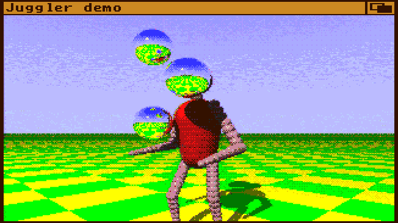

 Homegirl
========
It's a fantasy console (like pico-8 or tic-80) inspired by the Amiga!

It has graphic resolutions similar to the OCS Amigas, multitasking, multiple screens and windows etc.. It has 4 channel 8-bit stereo sound and eventually ability to mount web-servers as drives..

The software for it, is based on Lua, which is a pretty simple and fast scripting language..

Once the console is somewhat complete, I plan on writing an "operating system" for it in Lua, which would resemble Workbench.. or you could even make your own, if you wanted..

Hopefully I would also get to make some decent tools, like text editor, music editor and paint program, so that you could make games or apps on the platform itself..!

Specs
-----
 - **Programming language:** Lua ([See wiki for API documentation](https://github.com/poeticAndroid/homegirl/wiki))
 - **Screen resolutions:** 32 screen modes ranging from 80x45 to 640x480 pixels
 - **Number of colors:** Up to 256 colors from a palette of 4096 colors
 - **Audio:** Four 8-bit PCM channels in stereo, playback up to 24 kHz
 - **Input:** Text, mouse and game input.. (Perhaps MIDI..?)*
 - **Filesystem:** Local system folder (and ability to mount Webservers as drives)*
 - **Native filetypes:** GIF for images and animations, WAV for sound samples

_*Work in progress_